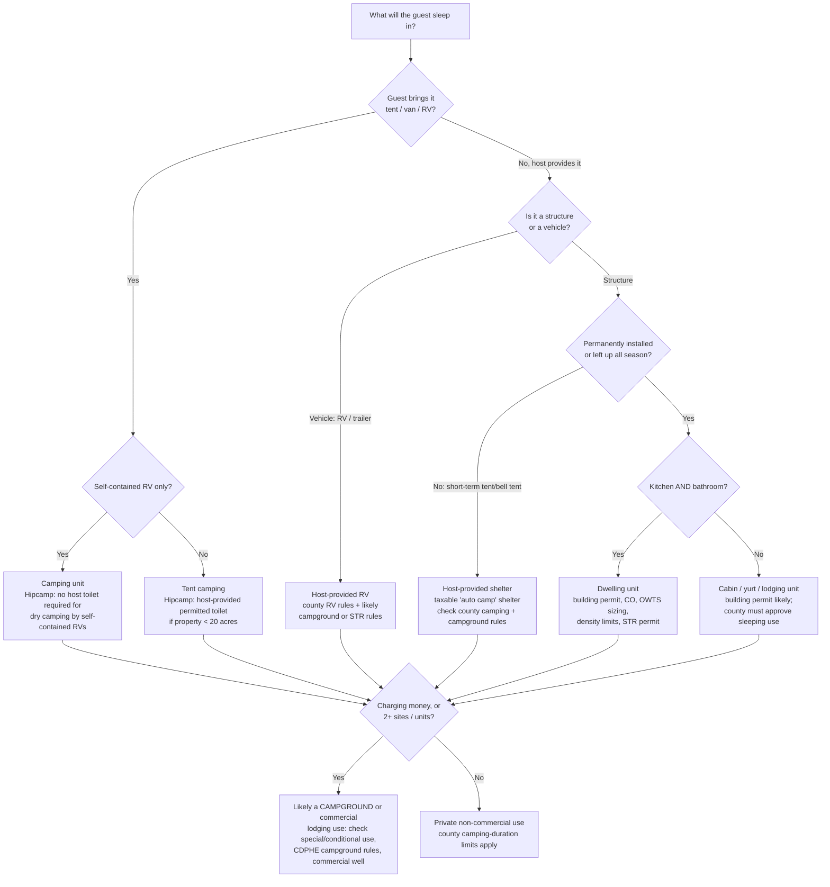

# What Counts as a "Home," Dwelling, or Camping Accommodation in Colorado?

**Short answer:** Colorado has no single statewide definition of "home" for zoning purposes. **Each county
defines it in its own code** (each municipality too, inside town limits). Across the state, though, the
definitions follow a common pattern, and so do the state and national standards that local codes borrow.
This page explains that pattern. For how a specific county does it, see its page in the
[County Matrix](counties/README.md).

## Why classification matters

What you call the thing a guest sleeps in decides which rules apply:

| If it's classified as... | Then you're looking at... |
|---|---|
| A **dwelling unit** | Dwelling-density limits (often 1 primary + maybe 1 ADU per lot), building permit and certificate of occupancy, OWTS sized per bedroom, possibly STR rules |
| A **camping unit** (tent, RV) | Camping-duration limits, camping permits, "campground" thresholds, sanitation conditions |
| An **accessory structure** (shed, studio, bunkhouse) | Building permit by size. Most counties don't let an accessory structure be slept in unless it's approved as a dwelling or lodging. |
| A **campground / lodging use** | Special or conditional use permit, CDPHE/local campground sanitation, commercial water supply, business licensing |

Hipcamp cares too. Its toilet policy requires a real toilet (Tier B-E) for any listing with sleeping
accommodations, but lets tent campers bring their own on larger properties. See
[Toilets](06-toilets-septic-waste.md).

## Core definitions

These are the standard definitions most Colorado codes use or borrow. Your county's wording controls.

### Dwelling unit

The International Residential Code (IRC), which most Colorado building departments adopt, defines a dwelling
unit as *a single unit providing complete, independent living facilities for one or more persons, including
permanent provisions for living, sleeping, eating, cooking and sanitation.*

The Colorado Division of Water Resources uses the same idea for well permits: *"A dwelling includes permanent
provisions for living, sleeping, eating, cooking, and sanitation."* It adds that an auxiliary living space
with a **separate entry and kitchen facilities** is generally a **second** single-family dwelling
([DWR Guideline 2023-1 §3](https://dwr.colorado.gov/services/well-permitting)). **Verified.**

**Rule of thumb:** permanent + sleeping + cooking + sanitation = a dwelling. Remove the kitchen or the
bathroom and it *may* become an accessory structure or a "cabin" instead. But many counties still won't
let anyone sleep in an accessory structure.

### Single-family residence / primary dwelling

The main dwelling on a lot. Rural zone districts commonly allow one, plus possibly an ADU. Gilpin County,
for example, allows one primary dwelling and one accessory dwelling in its RR and RS districts. **Reported.**

### Accessory dwelling unit (ADU)

A second, smaller dwelling on the same lot. Under **[HB24-1152](https://leg.colorado.gov/bills/hb24-1152)**, "subject jurisdictions" have had to allow one
ADU per single-family lot through administrative approval since June 30, 2025. Subject jurisdictions are
municipalities of 1,000+ people in an MPO area, and counties with a census-designated place of 10,000+ people
in an MPO area. **This covers mostly Front Range metro areas, not most rural land.** Local governments keep
some control over renting ADUs short-term. **Reported.** See [DOLA ADU page](https://dlg.colorado.gov/accessory-dwelling-units).

### Manufactured home, mobile home, modular home

| Term | What it is | Standard |
|---|---|---|
| **Mobile home** | Factory-built on a chassis *before* June 15, 1976 | Pre-HUD code |
| **Manufactured home** | Factory-built on a permanent chassis, 1976 or later | Federal HUD code (24 CFR 3280) |
| **Modular / factory-built structure** | Factory-built to the same code as site-built, set on a permanent foundation | Colorado Division of Housing certification |

Under **[C.R.S. 30-28-115](https://codes.findlaw.com/co/title-30-government-county/co-rev-st-sect-30-28-115/)**, counties can't use zoning to exclude homes certified by HUD or the Colorado
Division of Housing (DOH). They *can* set foundation, minimum floor area, setback and aesthetic standards.
**Reported** (statute summary).

### Tiny home vs. tiny house (Colorado-specific)

Colorado uses **two different terms** since **[HB22-1242](https://leg.colorado.gov/bills/hb22-1242)**:

| | Tiny **Home** | Tiny **House** |
|---|---|---|
| Built | In a factory, to DOH-adopted standards, with plans approved by DOH | On site, under the local building code (IRC appendix for ≤400 sq ft) |
| Chassis | **Permanent chassis**, on a permanent or temporary foundation | Normal foundation |
| Status | "Approved for long-term living just like modulars, HUD code homes, and mobile homes" | A small site-built dwelling |
| Not the same as | An RV or park-model RV | An RV |

Source: [DOH Tiny Homes & Tiny Houses](https://doh.colorado.gov/tiny-homes). **Verified.** A "tiny house on
wheels" built to RV standards is an **RV**, not a tiny home. Elbert County's code says so directly.

### Recreational vehicle (RV), travel trailer, park model

A vehicle-type unit designed for **temporary** recreational, camping or travel living: motor homes, travel
trailers, fifth wheels, truck campers, camping trailers. Park-model RVs (ANSI A119.5) are still RVs.

Colorado counties overwhelmingly **don't** treat an RV as a dwelling:

- **El Paso:** occupying an RV on private property is not allowed except during construction with a building permit and TUP.
- **Pueblo:** an RV can't be used as a residence on a vacant parcel outside an RV park.
- **Saguache and Alamosa:** an RV, camper or tent may never be a permanent residence.
- **Gunnison:** RVs don't meet local snow-load/insulation standards and aren't year-round homes.
- **Delta County is a notable exception.** A dwelling unit there may be an RV if it's connected to permanent water, wastewater and electricity.

**Reported**, via the county pages.

CDPHE's campground rule sorts camping vehicles into three types. **Verified**
([6 CCR 1010-9 §2](https://www.law.cornell.edu/regulations/colorado/6-CCR-1010-9-2.0)):

- **Self-contained:** toilet, lavatory, potable-water tank and sewage holding tank.
- **Independent:** toilet, lavatory and bathing, but needs a sewer connection.
- **Dependent:** lacks toilet/lavatory/bathing, so it relies on a service building.

### Tent, yurt, teepee, dome, bell tent

- A **tent** a camper brings is camping.
- A tent-like shelter **provided by the host** (a yurt, teepee, canvas bell tent or dome) is treated differently:
  - **Tax:** the Colorado Department of Revenue counts a "temporary or permanent overnight shelter (such as a tent, yurt, teepee, or other shelter) provided by the owner" as a feature of a taxable **auto camp**. **Verified.** See [Taxes](10-taxes-and-licensing.md).
  - **Building:** a yurt on a platform, left up for the season or longer, is often a **structure** needing a building permit (snow and wind loads, egress, fire separation). Counties vary.
  - **Chaffee County's** personal-camping rule lists yurts and tipis as camping equipment. Its *commercial* private-lands campsites are primitive tent/RV/van sites with no permanent lodging. **Verified** ([Chaffee](counties/chaffee.md)).
  - **Gilpin County** says yurts, tiny homes and tents may not be rented out publicly. **Verified** ([Gilpin](counties/gilpin.md)).

### Cabin

Not a legal category by itself. A cabin with a kitchen and bathroom is a **dwelling unit**. A sleeping-only
cabin is usually an accessory structure or a **lodging unit** that the county must approve. Fremont County only
allows "recreational cabins" as part of an approved Travel Trailer Park & Campground. **Reported.**

### Campsite, campground, primitive campground

| Term | Source | Meaning |
|---|---|---|
| **Campground** (state) | CDPHE [6 CCR 1010-9](https://www.sos.state.co.us/CCR/DisplayRule.do?action=ruleinfo&ruleId=2429) | Organized campgrounds, including "privately owned campgrounds which are made available, either with or without a fee to the public." Semi-developed and higher categories require **two or more campsites**. **Verified.** |
| **Primitive campground** (state) | 6 CCR 1010-9 | Walk-in, pack-in or equestrian access only, no facilities. Exempt from most of the rule. **Verified.** |
| **Semi-primitive campground** (state) | 6 CCR 1010-9 | Walk-in, equestrian or motorized-trail access, with rudimentary facilities (privies, fireplaces). Limited requirements. **Verified.** |
| **Campground** (county examples) | Lake County | **Two or more camping units** on a parcel = a campground. **Reported.** Private camping there is *non-commercial* only (**Verified**). |
| | Weld County | Temporary RV/tent placement "operated on a commercial basis for use by the public." **Reported.** |
| | Gilpin County | Renting campsites isn't a use by right in any district. Campgrounds need a Special Use in RR or commercial zones. **Verified.** |
| | Clear Creek County | "Commercial Camping" is any camping where money or something of value is exchanged, allowed only in C-OR/C-TR/PD zones. **Verified.** |
| | Routt County | "Commercial Camping" is "open to the general public and consists of one or more camping spaces." **Verified.** |

**The pattern:** the moment you charge money or have two or more sites, many counties stop calling it
"camping on your land" and start calling it a **campground**.

### Temporary structure / temporary use

A use or structure allowed for a limited time under a Temporary Use Permit (TUP). Examples: La Plata allows
120 consecutive or 30 non-consecutive days a year; Archuleta allows an RV TUP of 120 days. **Reported.** TUPs are
generally not a lasting basis for an ongoing Hipcamp listing.

## Decision flowchart

## Worked examples

| Setup | Likely classification | First things to check |
|---|---|---|
| 3 tent sites on 40 acres, guests bring everything | Paid camping, probably a campground (3 sites) | County campground/special-use path; Hipcamp lets campers BYO toilet on 20+ acres |
| 1 tent site on 8 acres | Paid camping; campground depends on county | Hipcamp requires a **permitted** toilet (<20 acres); county 1-unit vs 2-unit threshold |
| Self-contained RV sites only, no hookups | Paid RV camping (not clearly an "auto camp" for state tax without hookups; see [Taxes](10-taxes-and-licensing.md)) | County RV-occupancy limits; Hipcamp toilet exception for self-contained dry camping |
| Canvas bell tent the host sets up each season | Host-provided shelter; taxable auto camp | Building permit for any platform; toilet Tier B-E (sleeping accommodation) |
| Dry cabin, no plumbing | Structure/lodging unit | Building permit, county approval of sleeping use, toilet Tier B-E |
| Tiny home (DOH-certified) with kitchen and bath | Dwelling unit | Dwelling density, OWTS, STR permit, CO certificate/installation inspection |

## Sources

- DWR Guideline 2023-1, *Uses of Water From Exempt and Small Capacity Wells* (read in full, 2026-09-29)
- [DOH: Tiny Homes and Tiny Houses](https://doh.colorado.gov/tiny-homes) (read 2026-09-29)
- [6 CCR 1010-9 §2.0 Definitions](https://www.law.cornell.edu/regulations/colorado/6-CCR-1010-9-2.0) (read 2026-09-29)
- [Colorado DOR: Rooms & Accommodations](https://tax.colorado.gov/sales-use-tax-topics-rooms-accommodations) (read 2026-09-29)
- County pages in [counties/](counties/README.md) (all **Needs confirmation**)
